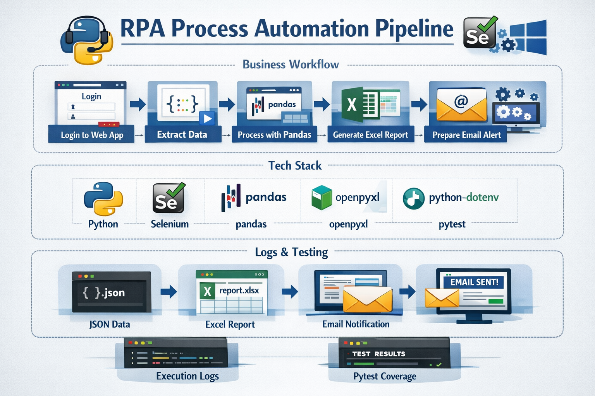

# RPA Process Automation Pipeline

A production-style Python automation project that simulates a complete business workflow using Selenium, pandas, openpyxl, configurable environment settings, and test coverage.



## Business Case

This project demonstrates a realistic automation pipeline:

- log into a web application
- navigate to a secure reporting page
- extract operational data
- save raw JSON output
- transform data with pandas
- generate an Excel report
- prepare an email notification payload
- support batch execution for Windows automation scenarios

## Tech Stack

- Python
- Selenium
- pandas
- openpyxl
- python-dotenv
- pytest

## Project Workflow

1. Load configuration from environment variables
2. Start a Selenium browser session
3. Log into the target web page
4. Navigate to the secure page
5. Extract page data
6. Save raw data as JSON
7. Process and structure the data with pandas
8. Export processed data to CSV
9. Generate an Excel report
10. Prepare an email payload
11. Save detailed logs for each execution

## Project Structure

```text
rpa_process_automation_pipeline/
|
|-- .env
|-- .env.example
|-- .gitignore
|-- README.md
|-- requirements.txt
|-- main.py
|-- run_pipeline.bat
|
|-- logs/
|-- data/
|   |-- raw/
|   |-- processed/
|   |-- downloads/
|   `-- output/
|
|-- tests/
|   |-- conftest.py
|   |-- test_settings.py
|   |-- test_data_processor.py
|   `-- test_excel_report.py
|
`-- src/
    |-- exceptions.py
    |-- browser/
    |   `-- driver_factory.py
    |-- config/
    |   `-- settings.py
    |-- pages/
    |   |-- login_page.py
    |   `-- report_page.py
    |-- workflows/
    |   `-- process_runner.py
    |-- processing/
    |   `-- data_processor.py
    |-- reporting/
    |   `-- excel_report.py
    |-- notifications/
    |   `-- email_sender.py
    `-- utils/
        `-- logger.py
```

## Setup

Create a virtual environment:

```powershell
python -m venv .venv
.\.venv\Scripts\activate
```

Install dependencies:

```powershell
pip install -r requirements.txt
```

## Environment Variables

Example `.env` configuration:

```env
BASE_URL=https://the-internet.herokuapp.com/login
DOWNLOAD_DIR=data/downloads
LOG_LEVEL=INFO
BROWSER=chrome
HEADLESS=False
LOGIN_USERNAME=tomsmith
LOGIN_PASSWORD=SuperSecretPassword!
EMAIL_ENABLED=False
EMAIL_TO=demo@example.com
EMAIL_SUBJECT=RPA Automation Report
```

## Run the Project

Standard run:

```powershell
python main.py
```

Run in headless mode:

```powershell
python main.py --headless
```

Run with demo email payload:

```powershell
python main.py --demo-email
```

Run through the batch file:

```powershell
.\run_pipeline.bat
```

The batch runner starts the pipeline in headless mode, appends console output to `logs/batch_output.log`, and returns a non-zero exit code if the run fails.

## Run Tests

```powershell
pytest
```

## Generated Outputs

The pipeline generates:

- raw JSON file in `data/raw/`
- processed CSV file in `data/processed/`
- Excel report in `data/output/`
- batch output log in `logs/batch_output.log`
- execution logs in `logs/`

## Demo Notes

This project currently uses the public demo site `https://the-internet.herokuapp.com/login` to simulate a secure business login flow.

Demo credentials:

- username: `tomsmith`
- password: `SuperSecretPassword!`

This makes the project easy to run, test, and demonstrate without requiring access to a private internal system.

## Windows Task Scheduler Setup

Use the batch file for scheduled execution:

1. Open Windows Task Scheduler
2. Create a new basic task
3. Set the trigger you want, for example daily at 09:00
4. Choose `Start a program`
5. Select `run_pipeline.bat` from the project root
6. Save the task and test it manually

Recommended setup:

- run whether the user is logged in or not
- use the same Windows account that has access to Chrome and the project files
- keep `.venv` installed and available in the project root
- review `logs/batch_output.log` and the timestamped logs in `logs/` after each test run

## Current Features

- Selenium-based login automation
- secure page validation
- raw data extraction
- pandas data transformation
- Excel report generation
- email payload preparation
- CLI arguments for headless and demo email modes
- timestamped execution logs
- Windows batch runner
- pytest coverage for core modules

## Future Improvements

- real data export from downloadable reports
- SMTP integration for actual email sending
- richer Excel styling and KPI sections
- retry logic for unstable UI elements
- screenshots for documentation
- Windows Task Scheduler integration
